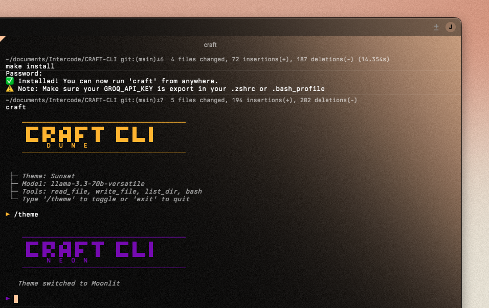

# 🛠️ CRAFT CLI (Ultra-Lite)

**Context-Aware Reasoning & Function Toolkit** - Brutally optimized AI coding assistant.

 

<div align="center">

<span> Dune | Moonlight Theme</span> 


</div>

##  Features

- **Ultra-Lite**: Zero flickering, fast terminal I/O.
- **Vibrant ASCII**: Lipgloss-styled output with Japanese-inspired aesthetic.
- **Code Labels**: Decorated blocks with language indicators (CSS, GO, etc.).
- **Token Budget**: Real-time tracking [current/max | prompt↑ completion↓].
- **Multi-Model**: Auto-fallback on rate limits (Llama 3.3 70B -> Mixtral).
- **Brutal Safety**: Dangerous commands blocked; aggressive truncation.

## 📦 Global Installation

To install CRAFT CLI globally so you can use it from any directory:

```bash
# 1. Build and copy to /usr/local/bin
make install

# 2. Add your API key to your shell config (~/.zshrc or ~/.bash_profile)
export GROQ_API_KEY=gsk_...
```

Now you can just type `craft` anywhere!

## 🚀 Quick Start (Local)

```bash
./run.sh
```

## 🎨 Interface Logic

- `▶` : User Input
- `┌` : Request Start
- `│` : Assistant Content
- `[T]` : Tool Action
- `├─ call:` : Function Call
- `├─ res:` : Tool Result
- `└─` : Response Complete

## 🧠 Model Fallback

1. `llama-3.3-70b-versatile` (Primary)
2. `llama-3.1-70b-versatile` (Fallback 1)
3. `mixtral-8x7b-32768` (Fallback 2)

## 🛡️ Safety & Truncation

- **Files**: Read truncated at 4KB.
- **Bash**: Output truncated at 500 chars.
- **Security**: Blocking `rm -rf /`, `mkfs`, `sudo`, and more.

## 🔧 Tools

- `read_file`: Safe read with markers.
- `write_file`: Atomic write with directory creation.
- `list_dir`: ASCII file tree with `[D]` and `[F]` icons.
- `bash`: Full shell access (guarded).

## 📊 Token Budget

- **Max**: 6000 tokens.
- **Target**: 4000 tokens (auto-eviction).
- **History**: Sliding window of 4 turns.

Clean, fast, beautiful. 🛠️
# craft-cli
# craft-cli
# craft-cli
# craft-cli
