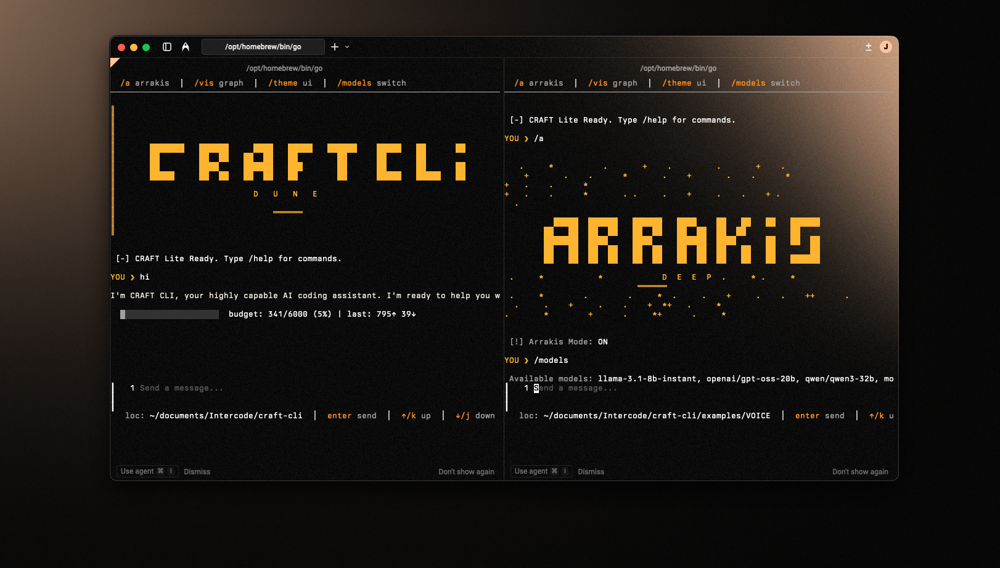

# [-] CRAFT CLI (Ultra-Lite)

**Context-Aware Reasoning & Function Toolkit** - Brutally optimized AI coding engine.

 

<p align="center"> Version 1.2</p>

## [-] Features

- **Ultra-Lite**: Zero flickering, fast terminal I/O.
- **Pure ASCII**: Lipgloss-styled output with Japanese-inspired aesthetic.
- **Code Labels**: Decorated blocks with language indicators (CSS, GO, etc.).
- **Context Graph**: Automatically indexes your project for smart context retrieval.
- **Diff Viewer**: Side-by-side comparison tool with snapshot tracking for before/after diffs.
- **Arrakis (The Voice)**: Deep logic suite for complex architectural tasks and reasoning amplification.
- **Groq Powered**: Lightning-fast inference via Groq Cloud.
- **Token Budget**: Real-time tracking [current/max | prompt↑ completion↓].
- **Multi-Model**: Auto-fallback on rate limits (Llama 3.3 70B -> Mixtral).
- **Brutal Safety**: Dangerous commands blocked; aggressive truncation.

## [-] Installation

```bash
# 1. Build and copy to /usr/local/bin
make install

# 2. Add your API key to your shell config (~/.zshrc)
export GROQ_API_KEY=gsk_...
```

Now you can just type `craft` anywhere!

## [-] Interface Logic

- `>` : User Input
- `loc: ` : Current working directory
- `[act]` : Tool Action
- `[-] res:` : Tool Result
- `[-]` : Response Complete

## [!] Arrakis (Deep Logic)
Trigger deep logic mode by starting your prompt with `/ARRAKIS` (or press `Tab` to toggle persistent mode):
- **Amplification**: Enhances reasoning for smaller tasks.
- **Decomposition**: Breaks large tasks into macro and micro tasks.
- **Traceability**: All thoughts are logged for transparency.

## [-] Shortcuts
- `Enter`: Send message
- `Alt+Enter`: New line (TUI)
- `Tab`: Toggle Arrakis Persistent Mode
- `Ctrl+C / Esc`: Quit
- `/models`: Switch between available LLMs
- `/vis`: Visualize context graph and Arrakis flow
- `/diff [file1] [file2]`: Open side-by-side diff viewer
- `/snapshot <file>`: Capture file state for comparison
- `/compare <file>`: Compare file against last snapshot
- See **[doc/DOCS.md](doc/DOCS.md)** for complete documentation.
- See **[FEATURES.md](FEATURES.md)** for a full list of capabilities.
- See **[BACKLOG.md](BACKLOG.md)** for planned enhancements.

## [-] Safety & Truncation

- **Files**: Read truncated at 4KB.
- **Bash**: Output truncated at 500 chars.
- **Security**: Blocking `rm -rf /`, `mkfs`, `sudo`, and more.

Clean, fast, beautiful. [-]
